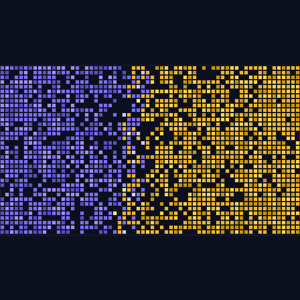

<p align="center">
  
</p>

# Monad Place — 千人链上像素战争 🟣🟡

> 链上的 r/place：一块 64×36 的共享画布，全场观众扫码参战，**每个像素 = 1 笔真实的 Monad 交易**。
> 它同时是一台**活动互动引擎**——三层收入模型，全部跑在链上、点得到、可演示。
> Monad Blitz@北京V2 参赛项目（Scaffold-ETH 2 · Hardhat）

## 这是什么

一块部署在 Monad 测试网上的共享像素画布。现场观众手机扫码 → 连接钱包 → 选择阵营（紫晶军团 ❄ / 黄金部落 🔥）→ 点击画布落子。每次落子都是一笔真实的链上交易；3 秒冷却由**智能合约强制**（链上规则，不是服务器）。投影大屏实时渲染画布翻涌、五声音阶音雨、TPS/并行仪表与阵营比分。终局主持人调用 `seal()` 冻结画布，整幅作品的 keccak256 指纹永久上链，整场战役并可随时回放。

## 为什么只有 Monad 行

千人并发落子 = 每秒数百笔真实交易，而像素画布是**并行执行的完美负载**：每人只写自己的格子，同块交易天然零冲突。Monad 的吞吐不是背景板，而是**比分牌**——人越多，链上体验越好，规模本身就是产品。

官方硬数据（docs.monad.xyz 已核验）：

| 指标 | 值 | 在本项目中的体现 |
| --- | --- | --- |
| 出块间隔 | **~400ms** | 落子 → 大屏翻涌的节奏基线 |
| 单块容量 | **最高 5,000 tx / 200M gas** | 「千人同刻」全场合唱的分母 |
| monadLogs 数据流 | 比标准事件确认**早 ~1s** | 像素比标准链早一秒上屏 |

**体感对比（全场合唱战报）**：3-2-1 倒计时后 3 秒窗口内，全场落子交易按区块聚类实时统计——示例：213 笔交易 · 覆盖 8 个区块 · 单块最高并发 41 笔。同样的交易在以太坊（~12s 出块、串行执行）需要排队**数十分钟级**；在 Monad，它们**同块并行完成**。并行执行不是宣传语，是大屏仪表上可测量的数字（同块并发数 + `eth_getBlockReceipts` 整链块吞吐，双通道实时读取）。

## 商业模式 — 三层收入模型

> **总纲**：Monad Place 是一个**活动互动引擎**——主办方付费发起定制画布战役（L1），玩家终局带走 NFT 纪念品、平台抽成（L2），战役全程数据可回放、成为活动方的链上数据资产（L3）。

| 层 | 收入源 | 定价逻辑 | 演示入口 |
| --- | --- | --- | --- |
| **L1 场次费** | 活动方/品牌方按场次付费定制战役 | 基础场次费 + 品牌主题加价 | `/campaign` 付费创建（测试币 0.1 MON） |
| **L2 NFT 分成** | 终局画布 NFT 铸造，平台 royalty 抽成 | 免费铸造 + 二级转售 5% 抽成 | `/play` owner 铸造 + 浏览器看 royalty |
| **L3 数据服务** | 战役回放/统计报告作为数据资产交付 | 按战役订阅或一次性 | `/stage?replay=1` 回放演示 |

- **L1 · 品牌战役**（`CampaignFactory.sol`）：品牌方付一笔战役费，创建专属画布——自定义标题、品牌双阵营色、时长。观众打的是品牌的颜色战争，终局画布就是品牌社区共同签名的作品。多收款留在合约，仅 owner 可提。
- **L2 · 终局 NFT**（`PlaceCanvasNFT.sol`，ERC-1155 + ERC-2981）：seal 后每人限铸 1 枚（tokenId = seal 块高，上限 300）；metadata 里写着当场的画布指纹、玩家数与总交易数（模板见 `packages/nextjs/public/nft.json`）；二级转售抽 5% 创作者分成，浏览器 NFT 页直接可见——**这是商业模式的链上凭证**。
- **L3 · 回放即数据资产**：seal 后整场战役可回放、可验证、可嵌入官网（`/stage?replay=1`，按时间轴 20–50 倍速重放涟漪与音符）——活动方的发布会战役永久在线，按战役收费的 SaaS 逻辑，「这段回放就是交付物」。

> 注：0.1 MON 场次费与 5% royalty 均为**测试网演示参数**，主网化只需换参数。

### 付费战役 30 秒上手（L1 演示动线）

1. 打开 `/campaign`，填写战役标题、双阵营名、时长（≤24h）
2. 支付 **0.1 测试 MON** → 钱包签名
3. 浏览器确认 `CampaignCreated` 事件 → **一笔真实成交**，专属画布合约已链上部署

<!-- 截图位：/campaign 创建成功态（整合点后补图） -->

## 差异化声明

与现有生态项目零重叠：协作画布/共享像素类命中数为 0。本项目为"百人并发交易→共享画布实时对抗"的竞技型现场体验，合约核心仅网格状态与事件，独立完整。落子音符采用五声音阶（宫商角徵羽），并发交易天然合成"链上音雨"。

## 页面

| 路由 | 用途 |
| --- | --- |
| `/` | 落地页（价值主张 + 硬数据 + 三层商业模式） |
| `/play` | 观众端：连钱包 → 选阵营 → 点画布落子（手机友好）；seal 后铸造终局 NFT |
| `/stage` | 大屏端：画布 + 涟漪 + 音效 + TPS/并行仪表 + 比分 + 排行榜 + 二维码 + 合唱战报 + 封盘横幅（投影用，无需钱包）；`?replay=1` 进入回放模式 |
| `/campaign` | 品牌战役：付费创建定制画布（L1 收入演示） |
| `/debug` | Scaffold-ETH 合约调试 UI |

## 开发

```bash
yarn install
yarn chain          # 终端1：本地区块链
yarn deploy         # 终端2：部署合约（本地）
yarn start          # 终端3：前端 http://localhost:3000
yarn test           # 合约测试（含 seal 权限/冷却/同色拒绝/阵营计数转移 + 商业合约用例）
```

## 部署到 Monad 测试网（ChainID 10143）

```bash
yarn generate                          # 生成部署账户（记住密码）
# 到 https://testnet.monad.xyz 领取测试币
yarn deploy --network monadTestnet     # 部署（构造参数 liveSeconds=28800）
yarn verify --network monadTestnet     # Sourcify 验证（BlockVision）
yarn vercel:yolo --prod                # 前端公网部署
```

> 注：verify 命令报错常为误导（官方文档说明），请到浏览器确认验证状态。

## 合约速览

**PlaceCanvas.sol**（主游戏，零改动）

- `place(x, y, color)` — 落子；校验存活/颜色/坐标/冷却/同色，覆盖敌格自动转移阵营计数
- `seal()` — 仅主持人（部署者）可调用，冻结画布并生成 keccak256 指纹
- `canvasHash()` / `getRow(y)` — 终局指纹与大屏冷启动
- 事件：`PixelPlaced` / `CanvasSealed`

**CampaignFactory.sol**（L1 · 独立部署，不碰主游戏合约）

- `createCampaign(title, team1, team2, liveSeconds)` — payable ≥ 0.1 MON，每场部署一个新的 PlaceCanvas
- `withdraw()` — 仅 owner 提款
- 事件：`CampaignCreated(id, sponsor, canvas, title)`

**PlaceCanvasNFT.sol**（L2 · ERC-1155 + ERC-2981）

- seal 后每人限铸 1 枚（tokenId = seal 块高），上限 300
- royalty 5% → 部署者；metadata 模板：`packages/nextjs/public/nft.json`

## 资产与文档

| 资产 | 路径 | 用途 |
| --- | --- | --- |
| LOGO / favicon | `packages/nextjs/public/logo.png` | 品牌标识（512×512，极简像素风·紫金双色·深底扁平） |
| OG 分享图 | `packages/nextjs/public/og.png` | 社交分享（1200×630） |
| NFT 元数据模板 | `packages/nextjs/public/nft.json` | L2 铸造 metadata（canvasHash/players/totalPlaced） |
| 落地页文案卡 | `packages/nextjs/public/docs/landing-copy.md` | 硬数据 + 三层商业模式贴入版（交 A2/调度席整合） |
| 演示资产与录屏分镜 | `packages/nextjs/public/docs/demo-assets.md` | 兜底 30s 录屏拍摄清单（供调度席） |
